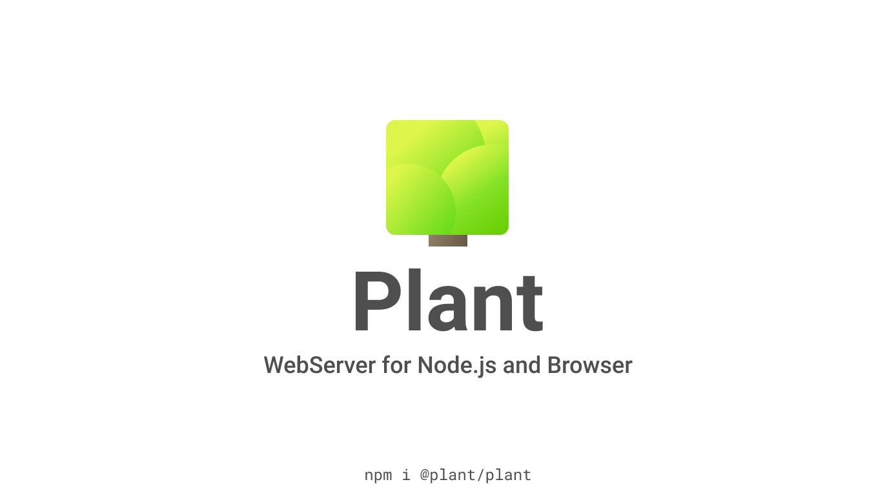

# [Plant](packages/plant) `@plant/plant`

[](https://npmjs.com/package/@plant/plant)
[](https://travis-ci.org/rumkin/plant)
[](https://npmjs.com/package/@plant/plant)


[NPM](https://npmjs.com/package/@plant/plant) ·
[Source](packages/plant) · [Readme](packages/plant/readme.md)

Plant is WebAPI standards based web server powered by ES2017, created with
modular architecture and functional design patterns in mind. It uses cascades
and contexts to be modular, pure and less coupled.

```javascript
const createServer = require('@plant/http');
const Plant = require('@plant/plant');
const Router = require('@plant/router');

const plant = new Plant()
const router = new Router()

router.get('/greet', async function({res}) {
    res.body = 'Hello World'
})

plant.use(router)

// Build request handler
createServer(plant)
.listen(8080);
```

## [Plant Router](packages/router) `@plant/router`

[NPM](https://npmjs.com/package/@plant/router) ·
[Source](packages/router) · [Readme](packages/router/readme.md)

Plant standalone router.

## [Plant HTTP](packages/http) `@plant/http`

[NPM](https://npmjs.com/package/@plant/http) ·
[Source](packages/http) · [Readme](packages/http/readme.md)

Plant adapter for native node.js http module. It creates server listener from plant instance.

## [Plant HTTPS](packages/https) `@plant/https`

[NPM](https://npmjs.com/package/@plant/https) ·
[Source](packages/https) · [Readme](packages/https/readme.md)

Plant adapter for native node.js https module. It creates server listener from plant instance and https options.

## [Plant HTTP Adapter](packages/http-adapter) `@plant/http-adapter`

[NPM](https://npmjs.com/package/@plant/http-adapter) ·
[Source](packages/http-adapter) · [Readme](packages/http-adapter/readme.md)

This handler connect Plant and native Node's HTTP server. Modules @plant/http and @plant/https are using it under the hood.

## License

MIT &copy; [Rumkin](https://rumk.in)
