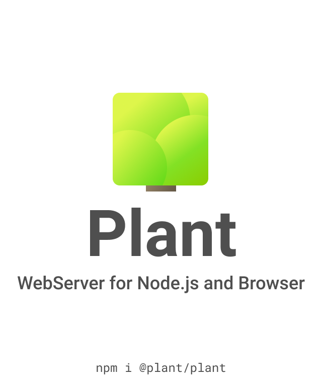

<p align="center">
    
</p>

# [Plant](packages/plant) `@plant/plant`

[](https://npmjs.com/package/@plant/plant)
[](https://travis-ci.org/rumkin/plant)
[](https://npmjs.com/package/@plant/plant)


[NPM](https://npmjs.com/package/@plant/plant) ·
[Source](packages/plant) · [Readme](packages/plant/readme.md)

Plant is WebAPI standards based HTTP/2 web server powered by ES2017, created with
modular architecture and functional design patterns in mind. It uses cascades
and contexts to be modular, pure and less coupled.

```javascript
const Plant = require('@plant/plant');
const Router = require('@plant/router');

const plant = new Plant()
const router = new Router()

router.get('/greet', async function({res}) {
    res.body = 'Hello World'
})

plant.use(router)
```

## [Plant Router](packages/router) `@plant/router`

[NPM](https://npmjs.com/package/@plant/router) ·
[Source](packages/router) · [Readme](packages/router/readme.md)

Plant standalone router.


## [Plant HTTP2](packages/http2) `@plant/http2`

[NPM](https://npmjs.com/package/@plant/http2) ·
[Source](packages/http2) · [Readme](packages/http2/readme.md)

Plant adapter for native node.js http2 module server. It creates server
listener from Plant instance and `http2.createServer()` [options](https://nodejs.org/dist/latest-v11.x/docs/api/http2.html#http2_http2_createserver_options_onrequesthandler). It's
usage is the same as https module.

```javascript
// Build request handler
const createServer = require('@plant/http2');
const Plant = require('@plant/plant');

const plant = new Plant();
plant.use(({res, socket}) => {
    // Send HTTP2 push
    if (socket.canPush) {
        socket.push(new Plant.Response({
            url: new URL('/style.css', res.url),
            headers: {
                'content-type': 'text/css',
            },
            body: 'html {color: green}',
        }))
    }

    res.body = 'Hello, World!'
})

createServer(plant)
.listen(8080)
```

## [Plant HTTPS2](packages/https2) `@plant/https2`

[NPM](https://npmjs.com/package/@plant/https2) ·
[Source](packages/https2) · [Readme](packages/https2/readme.md)

Plant adapter for native node.js http2 module SSL server. It creates server
listener from Plant instance and `http2.createSecureServer()` [options](https://nodejs.org/dist/latest-v11.x/docs/api/http2.html#http2_http2_createsecureserver_options_onrequesthandler). It's
usage is the same as https module.

```javascript
// Build request handler
const createServer = require('@plant/https2');
const Plant = require('@plant/plant');

const plant = new Plant();
plant.use(({res, ssl, socket}) => {
    const peerCert = ssl.getPeerCertificate()

    // Send HTTP2 push
    if (socket.canPush) {
        socket.push(new Plant.Response({
            url: new URL('/style.css', res.url),
            headers: {
                'content-type': 'text/css',
            },
            body: 'html {color: green}',
        }))
    }

    res.body = 'Hello, World!'
})

createServer(plant, {
    key: Buffer.from('...'),
    cert: Buffer.from('...'),
})
.listen(8080)
```

## [Plant HTTP](packages/http) `@plant/http`

[NPM](https://npmjs.com/package/@plant/http) ·
[Source](packages/http) · [Readme](packages/http/readme.md)

Plant adapter for native node.js http module. It creates server listener from plant instance.

```javascript
// Build request handler
const createServer = require('@plant/http');
const Plant = require('@plant/plant');

const plant = new Plant();
plant.use(({res}) => {
    res.body = 'Hello, World!'
})

createServer(plant).listen(8080)
```

## [Plant HTTPS](packages/https) `@plant/https`

[NPM](https://npmjs.com/package/@plant/https) ·
[Source](packages/https) · [Readme](packages/https/readme.md)

Plant adapter for native node.js https module. It creates server listener from plant instance and https options.

```javascript
// Build request handler
const createServer = require('@plant/https');
const Plant = require('@plant/plant');

const plant = new Plant();
plant.use(({res, ssl}) => {
    const peerCert = ssl.getPeerCertificate()

    res.body = 'Hello, World!'
})

createServer(plant, {
    key: Buffer.from('...'),
    cert: Buffer.from('...'),
})
.listen(8080)
```

## [Plant HTTP Adapter](packages/http-adapter) `@plant/http-adapter`

[NPM](https://npmjs.com/package/@plant/http-adapter) ·
[Source](packages/http-adapter) · [Readme](packages/http-adapter/readme.md)

This handler connect Plant and native Node's HTTP server. Modules @plant/http and @plant/https are using it under the hood.

## License

MIT &copy; [Rumkin](https://rumk.in)
